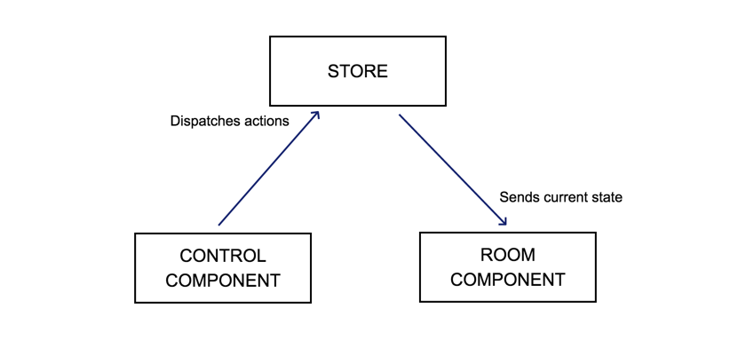

# House automation

A simple house automation application written in JavaScript with mobile support

## Demo

Live version can be found at http://home-automation.likeadev.com.

## Requirements

- `Node.js >= 13.8.0`
- `Yarn >= 1.22.0`

## Available run scripts
Remember to first install required node dependencies through `yarn install`.

Just type `yarn <taskNameHere>`. Tasks list:

- `watch` - build project in development mode and initialize a watcher
- `build` - build project for development purposes
- `build:prod` - build project using production settings
- `lint` - lints `*.js` and `*.jsx` files

## Architecture

The application's architecture is built around re-usable, nestable components and a store. The graph below illustrates
the communication pipeline between elements of the application:

In relation to aforementioned illustration:

- `store` - keeps current application state and allows components to dispatch actions that update the state or to
subscribe to state changes
- `control component` - controls state of the room by dispatching actions to the store
- `room component` - subscribes to the store to render current state of the room

## Components

More information on how to build your own components can be found in [Components.md](docs/Components.md)
